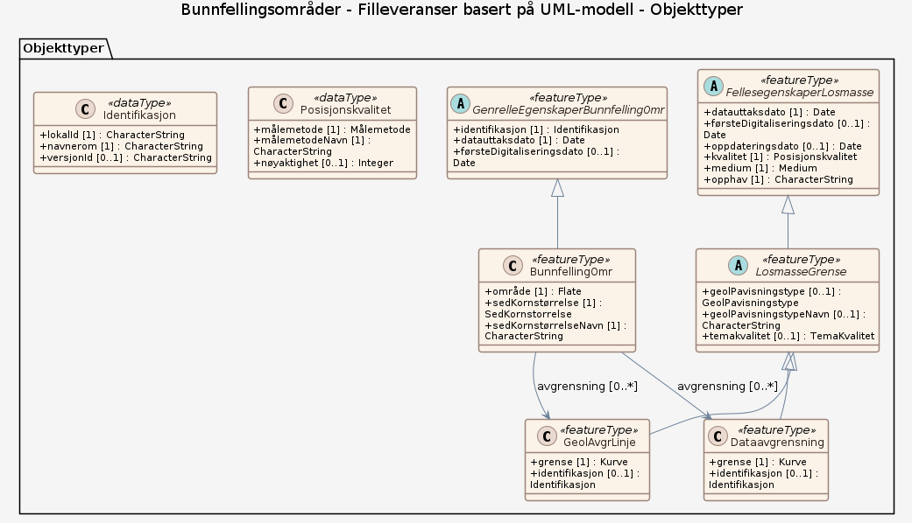

### Datamodell - Bunnfellingsomrader

➡️ [Se full datamodell for omfang "Bunnfellingsomrader" (diagram per pakke og objektkatalog)](bunnfellingsomrader/objektkatalog.html)

### Datamodell - Filleveranser basert på UML-modell

➡️ [Se full datamodell for omfang "Filleveranser basert på UML-modell" (diagram per pakke og objektkatalog)](filleveranser-basert-pa-uml-modell/objektkatalog.html)
