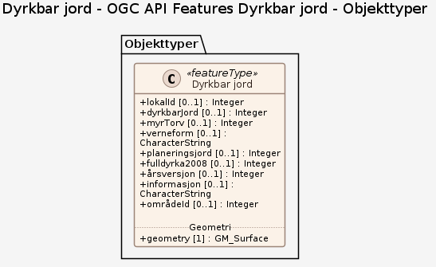

### Datamodell - Filleveranse

➡️ [Se full datamodell for omfang "Filleveranse" (diagram per pakke og objektkatalog)](filleveranse/objektkatalog.html)

### Datamodell - OGC API Features Dyrkbar jord

➡️ [Se full datamodell for omfang "OGC API Features Dyrkbar jord" (diagram per pakke og objektkatalog)](ogc-api-features-dyrkbar-jord/objektkatalog.html)
