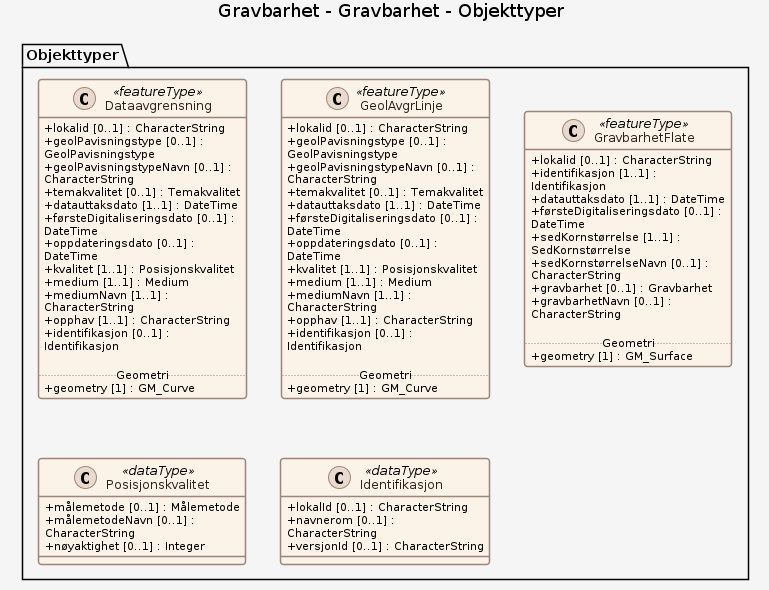

# Produktspesifikasjon: Gravbarhet

*Datasettet viser om det er lett eller vanskelig å grave i bunnen. Gravbarhet er basert på sedimentfordeling, og angir både hvor enkelt det er å grave i bunnen og den forventede stabiliteten til det utgravde området. For eksempel vil sandige sedimenter gjerne kollapse fortere etter utgravning enn hva mer finkornig materiale vil.*

**Nøkkelord:** sedimentasjon, bunnforhold, fjord, kyst, havbunn, marin, marine grunnkart, sjøbunn, NGU, stabilitet, Oslofjorden, Drammensfjorden, Hvaler, Froan, Andfjorden, Fosnes, Vågsfjorden, Sørøysundet, Saltstraumen, Søre Sunnmøre, Rijpfjorden, Kongsfjorden, Norge digitalt, MarineGrunnkart, modellbaserteVegprosjekter, fellesDatakatalog, Geologi, Kyst og fiskeri, LosmasseGrense, FellesegenskaperLosmasse, GravbarhetFlate, GeolAvgrLinje, geolPavisningstype, geolPavisningstypeNavn, sedKornstørrelse, sedKornstørrelseNavn, gravbarhet, gravbarhetNavn

**Emnekategorier:** Geovitenskapelig informasjon

**Geografisk utstrekning**:

- **Vest**: 2.0
- **Øst**: 33.0
- **Sør**: 57.0
- **Nord**: 72.0

**Tidsmessig utstrekning**:

- **Tidsperiode**:
  - **Fra**: 2005-05-04
  - **Til**: 2025-03-24

## Om spesifikasjonen

> **Denne versjonen av produktspesifikasjonen:**  
> **Opprettet dato:** 2005-05-04 
> **Endret dato:** 2025-03-24 
> **Språk:** nor 
> **Kontaktinformasjon:** Norges geologiske undersøkelse, [Sigrid.Elvenes@ngu.no](mailto:Sigrid.Elvenes@ngu.no)

## Om produktet Gravbarhet

> **Romlig representasjonstype:** Vektor 
> **Unik identifikator:** <https://data.geonorge.no/sosi/geologi/gravbarhet> 
> **Kontaktinformasjon:** Norges geologiske undersøkelse, [Sigrid.Elvenes@ngu.no](mailto:Sigrid.Elvenes@ngu.no)
>
> **Romlig oppløsning:**
>
> **Ekvivalent målestokk**: 10000 20000 50000
>
> **Begrensninger:**
>
> **Ressursbegrensninger**:
>
> - **Bruksbegrensninger**: Detaljnivået på datasettet tilsier bruk innenfor kartmålestokken: 1:5 000 - 1:50 000.
>
> **Juridiske begrensninger**:
>
> - **Tilgangsbegrensninger**: Åpne data
> - **Bruksbegrensninger**: Lisens
> - **Lisens**: Norsk lisens for offentlige data (NLOD)
> - **Lisenslenke**: <http://data.norge.no/nlod/no/1.0>

### Formål

Gravbarhet er et avledet temakart som presenterer kornstørrelsesdata på en spesialtilpasset måte. Datasettet viser om det er lett eller vanskelig å grave i bunnen.

### Bruksområde

Datasettet kan anvendes som underlag i overordnet areal- og miljøplanlegging, i forbindelse med installasjoner på sjøbunnen osv.

## Omfang

### Hele datasettet

**Nivå**: dataset

**Nivåbeskrivelse**: Gjelder hele datasettet. Hvis omfang ikke er oppgitt under en overskrift, gjelder teksten for hele datasettet og alle leveranser

### Gravbarhet

**Nivå**: dataset

**Nivåbeskrivelse**: OGC API – Features (koblet til datasettet i Geonorge)

## Datainnhold og struktur

### Datamodell - Gravbarhet

➡️ [Se full datamodell for omfang "Gravbarhet" (diagram per pakke og objektkatalog)](gravbarhet/objektkatalog.html)

## Referansesystem

| EPSG-kode | Navn på referansesystem |
| --- | --- |
| [EPSG:25832](https://epsg.io/25832) | [EUREF89 UTM sone 32, 2d](https://register.geonorge.no/epsg-koder) |
| [EPSG:25833](https://epsg.io/25833) | [EUREF89 UTM sone 33, 2d](https://register.geonorge.no/epsg-koder) |
| [EPSG:25835](https://epsg.io/25835) | [EUREF89 UTM sone 35, 2d](https://register.geonorge.no/epsg-koder) |
| [EPSG:32632](https://epsg.io/32632) | [WGS84 UTM sone 32, 2d](https://register.geonorge.no/epsg-koder) |
| [EPSG:32633](https://epsg.io/32633) | [WGS84 UTM sone 33, 2d](https://register.geonorge.no/epsg-koder) |
| [EPSG:32635](https://epsg.io/32635) | [WGS84 UTM sone 35, 2d](https://register.geonorge.no/epsg-koder) |
| [EPSG:4326](https://epsg.io/4326) | [WGS84 Geografisk](https://register.geonorge.no/epsg-koder) |

## Datakvalitet

**Nivå**: dataset

- **Kvalitetsmål**: SOSI produktspesifikasjon: Gravbarhet
  **Målebeskrivelse**: Dataene er ikke vurdert iht produktspesifikasjonen
  **Beskrivende resultat**: Dataene er ikke vurdert iht produktspesifikasjonen

- **Kvalitetsmål**: Sosi applikasjonsskjema
  **Målebeskrivelse**: SOSI-filer er ikke vurdert i henhold til applikasjonsskjema
  **Beskrivende resultat**: SOSI-filer er ikke vurdert i henhold til applikasjonsskjema

- **Kvalitetsmål**: Sosi applikasjonsskjema
  **Målebeskrivelse**: GML-filer er ikke vurdert i henhold til applikasjonsskjema
  **Beskrivende resultat**: GML-filer er ikke vurdert i henhold til applikasjonsskjema

- **Kvalitetsmål**: Prosentvis dekning i forhold til datasettets utstrekning
  **Målebeskrivelse**: Datasettets faktiske kartlagte areal i forhold til datasettets spesifiserte utstrekning
  **Resultat**: 5

- **Kvalitetsmål**: Prosentvis oppfyllelse av FAIR-prinsipper
  **Målebeskrivelse**: Angir fullstendighet i forhold til krav fra FAIR-prinsippene (The FAIR Guiding Principles for scientific data management and stewardship)
  **Resultat**: 96

- **Kvalitetsmål**: FAIR
  **Resultat**: Prosentvis oppfyllelse av FAIR-prinsipper: 96%

- **Kvalitetsmål**: Coverage
  **Resultat**: Prosentvis dekning i forhold til datasettets utstrekning: 5%

## Datafangst og produksjon

**Datainnsamling og prosessering**:

- **Prosesstrinn**:
  - **Beskrivelse**: Gravbarhet er et avledet temakart som presenterer kornstørrelsesdata på en spesialtilpasset måte. Kornstørrelsesdata er basert på tolkning av video av sjøbunnen, tolkning av digitale reflektivitetsdata, samt tolkning av analoge og digitale seismiske data. Akustiske data og video er verifisert med analyser av bunnprøver. Detaljerte vanndypsdata har inngått som støtte i tolkningen. Datasettet er digitalisert og tilrettelagt vha. ArcGIS verktøy. Metodikken er beskrevet i egenskapsfeltene Målemetode og GeolPavisningstype. Temakoder og egenskaper følger i hovedsak SOSI-standarden.

## Vedlikehold

**Vedlikeholdsfrekvens**: Etter behov

**Status**: Kontinuerlig oppdatert

## Presentasjon

**navn**: Tegneregler

**Lenke**:
<https://register.geonorge.no/tegneregler/gravbarhet>

## Leveranse

| Tjeneste | Endepunkt | Type | Format | Leveranseenheter |
| --- | --- | --- | --- | --- |
| Egen nedlastningsside | [Lenke](http://geo.ngu.no/download/order?dataset=706) | WWW:DOWNLOAD-1.0-http--download | FGDB, GML, SOSI |  |
| Geonorge nedlastning | [Lenke](https://nedlasting.ngu.no/api/capabilities/) | GEONORGE:DOWNLOAD | FGDB, GML, SOSI |  |
| Atom Feed | [Lenke](https://nedlasting.ngu.no/api/atom/6f383993-592d-4c1f-bcaf-e4c905af6ddb) | W3C:AtomFeed | FGDB, GML, SOSI |  |
| Bunnsedimenter (kornstørrelse) detaljert | [Lenke](https://geo.ngu.no/mapserver/MarineGrunnkartWMS?REQUEST=GetCapabilities&SERVICE=WMS) | Tjenestelag | image/png |  |
| Marine grunnkart WMS | [Lenke](https://geo.ngu.no/mapserver/MarineGrunnkartWMS?REQUEST=SERVICE=WMS&request=GetCapabilities) | WMS-tjeneste | image/png |  |

## Metadata

**Metadatastandard**: ISO19115

**Metadatastandardversjon**: 2003

**Metadatadato**: 2026-08-24

**språk**: nor

**Kontakt**:

- **Organisasjon**: Norges geologiske undersøkelse
- **Kontaktperson**: Janne Grete Wesche
- **Logo**: <https://register.geonorge.no/data/organizations/970188290_NGU_hovedlogo_svart.svg> thumbnail.png
- **Epost**: metadataansvarlig@ngu.no
- **rolle**: pointOfContact

**Metadataidentifikator**:

- **Utsteder**: Geonorge
- **kode**: 6f383993-592d-4c1f-bcaf-e4c905af6ddb
- **koderom**: <https://kartkatalog.geonorge.no/metadata/>
- **Metadatalenke**: <https://kartkatalog.geonorge.no/metadata/6f383993-592d-4c1f-bcaf-e4c905af6ddb>

## Tilleggsinformasjon

Datasettet dekker kun enkelte kyst- og fjordområder. Datasettet har varierende detaljeringsgrad, og detaljeringsgraden varierer fra sted til sted.
